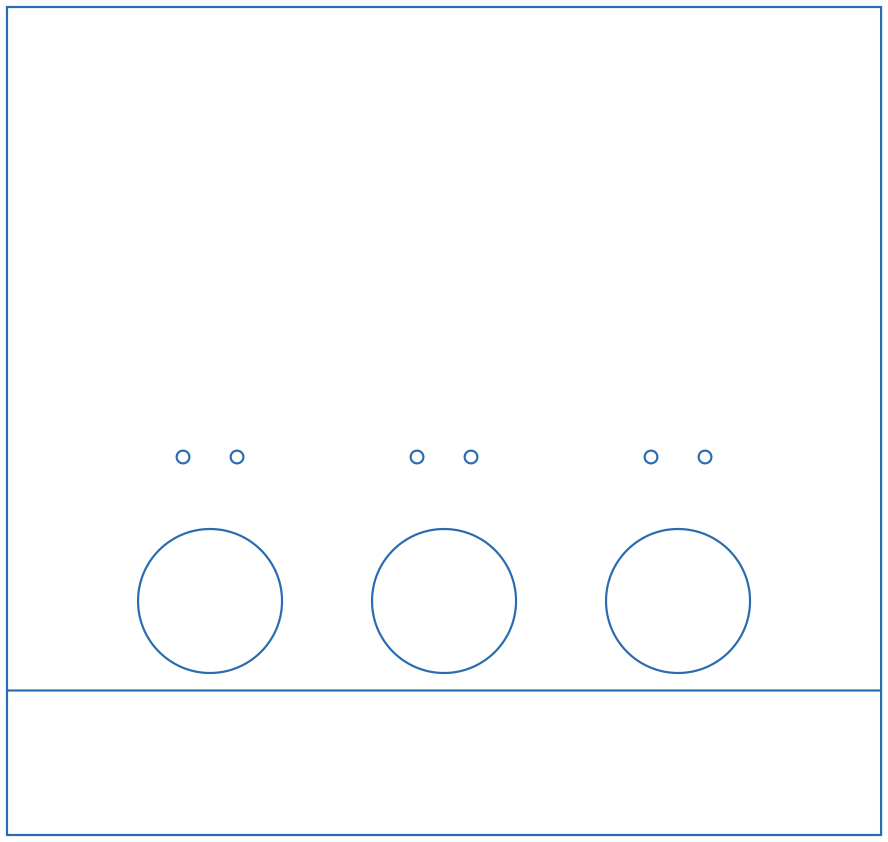
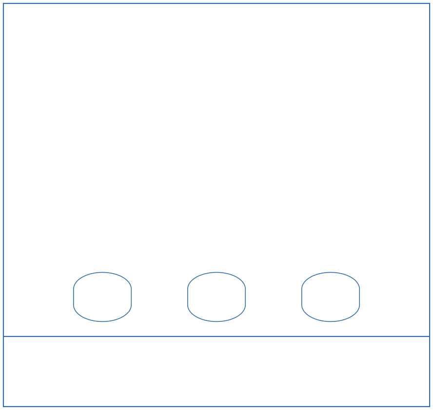
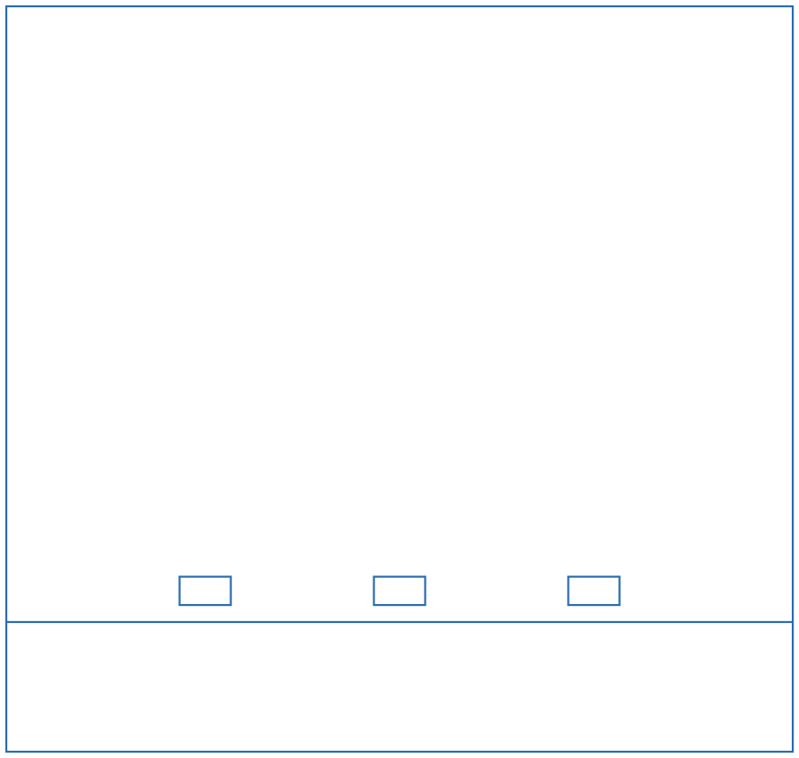
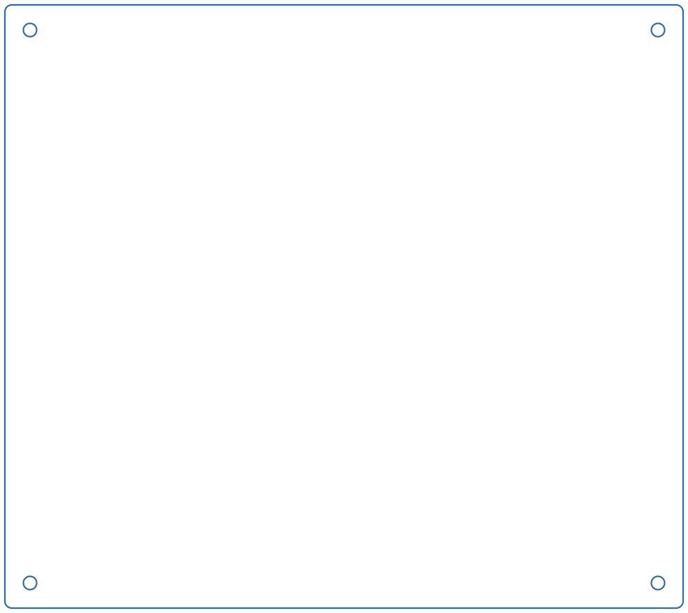
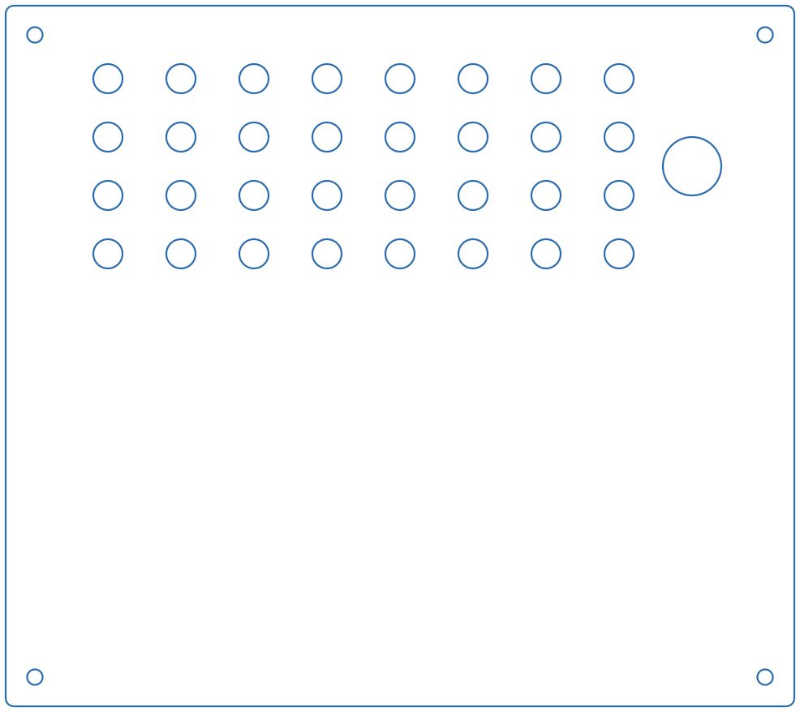

# Enclosure (laser-cut parts)

Each Rat Academy box is a laser-cut enclosure. It has a **port wall** holding the
nose-pokes, a blank wall opposite it, two side walls, a base and a ventilated lid.
This page lists every cut file, what it is, and its measured dimensions.

!!! tip "Download everything"
    - Vector files for the laser cutter (SVG): [`files/laser-cut/svg/`](../files/laser-cut/svg/BottomBase.svg). The links in each table below are per-file.
    - Original AutoCAD drawings (DWG): [`ABSBottomMG.dwg`](../files/laser-cut/dwg/ABSBottomMG.dwg) ·
      [`bpodPortsWallMG.dwg`](../files/laser-cut/dwg/bpodPortsWallMG.dwg) ·
      [`sideWalls.dwg`](../files/laser-cut/dwg/sideWalls.dwg) ·
      [`TopLid2MG.dwg`](../files/laser-cut/dwg/TopLid2MG.dwg)

## Cut list for one box

| Qty | Part | File to cut | Size (W × H) |
|---:|---|---|---|
| 1 | Port wall (nose-poke wall) | [`FrontBackPortWall_Rat_v5.svg`](../files/laser-cut/svg/FrontBackPortWall_Rat_v5.svg) *(current)* | 12.14 × 11.50 in (308 × 292 mm) |
| 1 | Opposite wall (blank) | [`FrontBackWall.svg`](../files/laser-cut/svg/FrontBackWall.svg) | 12.14 × 11.50 in (308 × 292 mm) |
| 2 | Side walls | [`SideWall_v2.svg`](../files/laser-cut/svg/SideWall_v2.svg) | 10.64 × 11.50 in (270 × 292 mm) |
| 1 | Base | [`BottomBase.svg`](../files/laser-cut/svg/BottomBase.svg) | 13.50 × 12.00 in (343 × 305 mm) |
| 1 | Lid | [`TopLid.svg`](../files/laser-cut/svg/TopLid.svg) | 13.50 × 12.00 in (343 × 305 mm) |
| opt. | Port-wall bottom strip | [`PortWallInsert.svg`](../files/laser-cut/svg/PortWallInsert.svg) | 12.14 × 2.00 in (308 × 51 mm) |

## Material

All parts are cut from **1/4 in (6 mm) acrylic sheet**. This matches the 0.25 in
deep notch in the side walls. One box takes about **6 ft² (0.55 m²)** of sheet
before nesting losses. Lay out your parts with that in mind.

!!! note "Base drawing name"
    The original base drawing is named `ABSBottomMG.dwg`. Some earlier builds may
    have used ABS for the base. The current standard is acrylic for every part.

!!! warning "Still to confirm: fasteners"
    How the walls are joined (rods, standoffs, brackets or solvent cement) isn't
    written down yet. If you've built a box, please add it. See
    [Contributing](../reference/contributing.md).

## Before you cut: check the scale

The SVGs have no physical units. Which file to use depends on how your laser
software reads them:

| Files | Units | Use with |
|---|---|---|
| `*.svg` (no suffix) | 72 units per inch | Adobe Illustrator, and most software that treats SVG px as points |
| `*_96.svg` | 96 units per inch | Inkscape, LightBurn and other CSS-px (96 dpi) software |

Only the current port wall (`FrontBackPortWall_Rat_v5_96.svg`) and the side wall
(`SideWall_v2_96.svg`) have 96-dpi versions. For other parts, scale by
**133.33 %** if your software assumes 96 dpi, or set the import DPI to 72.

!!! danger "Always measure after importing"
    Before cutting, check that the port wall measures **12.14 × 11.50 in
    (308 × 292 mm)** and the base measures **13.50 × 12.00 in (343 × 305 mm)**.
    If it's 75 % of that, you imported at the wrong DPI.

All cut lines are blue (`#0000FF`) hairlines, so they import as a single
vector-cut layer.

## Part details

All dimensions were measured from the SVG geometry (72 units per inch).

### Port wall: `FrontBackPortWall_Rat_v5` (current)

<figure markdown>
  { .cut-preview }
</figure>

- Outline: **12.14 × 11.50 in**.
- **Three 2.00 in (50.8 mm) round nose-poke openings**, 3.25 in (82.6 mm) apart
  center to center. The middle port is centered on the wall. Port centers are
  **3.24 in above the bottom edge** (1.24 in above the split line).
- Above each port there are **two 0.177 in (4.5 mm) holes**, 0.75 in apart and 2.0 in above
  the port center. These are clearance holes for #8 / M4 screws, probably for the
  nose-poke or cue-light mounting.
- One **full-width line 2.00 in above the bottom edge** splits off a 2 in strip.
  `PortWallInsert.svg` is that same strip as its own file, so you can recut it
  separately. *(What the strip is for, e.g. sitting below a floor insert or giving
  access to the port wiring, is still to be documented.)*

### Older port-wall versions (for reference)

<figure markdown>
  
  <figcaption><code>FrontBackPortWall_v2.svg</code>: three rounded (obround) openings,
  1.65 × 1.40 in (42 × 36 mm), on the same 3.25 in spacing. No mounting holes.</figcaption>
</figure>
<figure markdown>
  
  <figcaption><code>FrontBackPortWall.svg</code>: three small 0.79 × 0.44 in (20 × 11 mm)
  rectangular openings, 3.0 in apart, centered about 2.5 in above the bottom edge.</figcaption>
</figure>

### Opposite wall: `FrontBackWall`

<figure markdown>
  { .cut-preview }
</figure>

A plain 12.14 × 11.50 in rectangle with no openings.

### Side walls: `SideWall_v2` (cut 2)

<figure markdown>
  { .cut-preview }
</figure>

- Outline: **10.64 × 11.50 in**.
- A **5.00 × 0.25 in (127 × 6.35 mm) notch** in the top edge, starting 1.50 in from
  one side, probably a pass-through for tubing or cables under the lid.

### Base: `BottomBase`

<figure markdown>
  { .cut-preview }
</figure>

- Outline: **13.50 × 12.00 in** with slightly rounded corners (r ≈ 0.14 in).
- **Four 0.265 in (6.7 mm) corner holes**, centered 0.50 in from each edge. They are
  clearance holes for 1/4 in or M6 hardware. The same pattern is on the lid, so the
  lid and base can be bolted or rodded together.

### Lid: `TopLid`

<figure markdown>
  { .cut-preview }
</figure>

- Same outline and **four corner holes** as the base.
- **32 ventilation holes**, each 0.50 in (12.7 mm), in a 4 × 8 grid on a 1.25 in
  pitch.
- **One 1.00 in (25.4 mm) hole** near one edge (center 11.75 in from the left and
  2.75 in from the top), probably for the water line, cables or a camera.

## Assembly

!!! note "Help wanted"
    No step-by-step assembly instructions or photos have been written yet. If you
    build a box, please add photos and the steps you followed (what goes where, which
    side of the port wall faces in, how the nose-pokes mount, how the water line is
    routed). See [Contributing](../reference/contributing.md).

A typical order, based on the parts above:

1. Cut all parts and peel the protective film.
2. Mount the nose-pokes ([Bpod port interface](https://sanworks.github.io/Bpod_Wiki/)
   or your own) into the three openings of the port wall. Use the small holes above
   each opening for the mounting screws.
3. Join the port wall, blank wall and the two side walls into a rectangle.
4. Seat the walls on the base and attach the lid using the four corner holes.
5. Route the water tubing and cables through the lid hole / side-wall notch to the
   valves and the Bpod outside the box.
6. Wipe down all surfaces before putting an animal in the box (see
   [Weekly maintenance](../operate/weekly-maintenance.md)).
