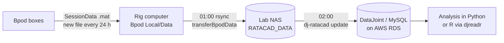

# Data pipeline

Every trial from every box ends up in a **DataJoint database (MySQL on AWS)**,
organized by animal, box, protocol and trial, so anyone in the lab can query it from
Python.



## 1. Bpod → rig computer

The protocol saves `Data/<Subject>/<Protocol>/Session Data/<Subject>_<Protocol>_<YYYYMMDD>_<HHMMSS>.mat`
throughout the session. The [NoGUI Bpod](../software/bpod.md) adds
`Info.BpodName` (which box) and starts a new file every 24 h.

!!! warning "Naming rule"
    File names are parsed by splitting on `_` into exactly four parts. **Subject and
    protocol names must not contain underscores**, or those files are skipped.

## 2. Rig computer → NAS

[`transferBpodData`](../reference/scripts.md) runs at 01:00 and rsyncs `Bpod Local/Data/*`
to `RATACAD_DATA` on the NAS. On Ubuntu it then deletes local files older than 30 days.

## 3. NAS → DataJoint

One computer, which has both the NAS mounted and database access, runs
[`updateDJ.sh`](../reference/scripts.md) every day at 02:00. The script reinstalls
`dj_ratacad` from GitHub and runs `dj-ratacad update`. It logs to `~/dj_ratacad.log`.

Example crontab entry:

```cron
0 2 * * * ~/ratacad/scripts/updateDJ.sh
```

`dj-ratacad update` does the following:

1. **`bpod.BpodMetadata`**: for each animal in `animal.Animal` that isn't
   euthanized, it finds new `.mat` files under
   `$RATACAD_DATA_DIR/<animal>/*/Session Data/` and records the session time, box
   (from `Info.BpodName`), protocol and settings.
2. **`bpod.BpodTrialData`**: adds any **new trials**, including from sessions that are
   still running. A file is marked closed (`FileClosed`) after 3 days with no new trials.
3. **Task tables**: populates each task's `*Trial` and `DailySummary` tables in
   parallel.

## Schemas

| Schema | Tables | Contents |
|---|---|---|
| `animal` | `Animal`, `Weight`, `Details`, `Euthanized` | animals (name, strain, DOB, sex), weights (with % of ad-lib baseline) |
| `bpod` | `BoxDesign`, `Bpod`, `Protocol`, `BpodMetadata`, `BpodTrialData`, `FileClosed` | box inventory (3-port, 6-port, lever-port), one row per file and per trial |
| `flashes` | `FlashesTrial`, `DailySummary` | flash-accumulation task |
| `flashcount` | `FlashCountTrial`, `DailySummary` | flash-counting task |
| `twostep` | `TwoStepTrial`, `DailySummary` | two-step task (6-port box) |
| `timingtask` | `TimingtaskTrialV2`, `DailySummary` | lever interval-timing task |
| `probabilities` | `ProbabilitiesTrial`, `DailySummary` | two-armed bandit |
| `uncertainflashinference` | `Trials`, `DailySummary`, `StageSummary` | populated by MATLAB (`dj_ratacad_matlab/`) |

An entity-relationship diagram is in the repo:
[`images/dj_ratacad_erd.png`](https://github.com/RatAcad/dj_ratacad/blob/master/images/dj_ratacad_erd.png).

## Install `dj_ratacad`

```bash
conda create -n dj python=3.10
conda activate dj
pip install git+https://github.com/RatAcad/dj_ratacad
```

Set up your database credentials once (you need a [database account](datajoint.md)):

```python
import datajoint as dj
dj.config["database.host"] = "<DB_HOST>"
dj.config["database.user"] = "<your_username>"
dj.config["database.password"] = "<your_password>"
dj.config.save_global()      # stores ~/.datajoint_config.json
```

The ingest computer also needs the NAS path:

```bash
export RATACAD_DATA_DIR=/path/to/NAS/RATACAD_DATA
```

## Adding animals

**An animal must be in `animal.Animal` before its data is ingested.**

```python
from dj_ratacad import animal
animal.Animal.insert1({
    "name": "MyRat",          # must match the Bpod subject name, no underscores
    "species": "Rat",
    "strain": "Long-Evans",
    "id": 12345,              # e.g. ear tag
    "dob": "2026-04-01",
    "pob": "BU",
    "sex": "M",
})
```

Weights can be recorded from the command line:

```bash
dj-ratacad weight MyRat -d 2026-10-02 -w 412 -b    # -b = ad-lib baseline weight
dj-ratacad weight MyRat -d 2026-10-09 -w 371       # % of baseline is computed
dj-ratacad weight MyRat -v                         # list weights
```

## Adding boxes and tasks

- **New or changed box:** *add a new row* to `bpod.Bpod` (box name, design, date,
  serial). **Never edit old rows**, because sessions are matched to the box version that
  was current at the time. If the box design is new, add it to `bpod.BoxDesign` too.
- **New task:** add a row to `bpod.Protocol`, create the MySQL schema
  (`<prefix>_<task>`), write `dj_ratacad/<task>.py` with `<Task>Trial` and
  `DailySummary`, and register a `populate_<task>()` process in `cli.py`. Do
  this on a branch and open a pull request.

## Querying data

```python
from dj_ratacad import flashes
trials = (flashes.FlashesTrial() & 'name="MyRat"').fetch(format="frame")
stage5 = (flashes.FlashesTrial() & "stage=5").fetch(as_dict=True)
```

```bash
dj-ratacad summary flashes -d 2026-10-01     # print the daily summary for a day
```

In R, use [`djreadr`](https://github.com/gkane26/djreadr).

!!! tip "Building your own academy?"
    You don't need AWS specifically. Any MySQL 8 server works, e.g. a lab server,
    a [DataJoint-hosted](https://datajoint.com/) database or Amazon RDS. Change the
    schema prefix (`scott_…`) in `dj_ratacad` to your own.
