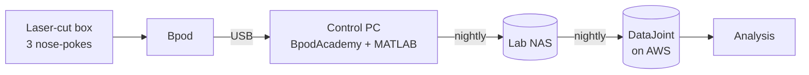

# Ratacademy Build Guide

**Ratacademy (RatAcad)** is a high-throughput, automated facility for training rats
on behavioral tasks. Animals live in laser-cut behavior boxes, earn water by
nose-poking, and move through training stages automatically. Dozens of boxes run
from a few computers, and every trial goes into a shared DataJoint database.

This guide collects everything needed to **build, run and maintain** a Ratacademy:
cut files, parts, computer setup, software, daily and weekly procedures, and the data
pipeline.

-   :material-map-marker-path: **Start here**

    ---

    How the pieces fit together, and the build roadmap step by step.

    [:octicons-arrow-right-24: Architecture](overview/architecture.md) ·
    [Roadmap](overview/roadmap.md)

-   :material-saw-blade: **Build the rig**

    ---

    Laser-cut enclosure files (SVG/DWG) with measured dimensions, and the parts list.

    [:octicons-arrow-right-24: Enclosure](build/enclosure.md) ·
    [Hardware](build/hardware.md)

-   :material-monitor-dashboard: **Set up software**

    ---

    Control computer, Bpod NoGUI, BpodAcademy, protocols.

    [:octicons-arrow-right-24: Ubuntu setup](setup/computer-ubuntu.md) ·
    [BpodAcademy](software/bpodacademy.md)

-   :material-calendar-check: **Run the academy**

    ---

    Daily checks, weekly water change, valve calibration.

    [:octicons-arrow-right-24: Daily](operate/daily.md) ·
    [Weekly](operate/weekly-maintenance.md)

-   :material-database: **Data**

    ---

    Bpod → NAS → DataJoint on AWS, and how to query it.

    [:octicons-arrow-right-24: Data pipeline](data/pipeline.md) ·
    [Access](data/datajoint.md)

-   :material-lifebuoy: **Help**

    ---

    Troubleshooting, scripts and how to improve this guide.

    [:octicons-arrow-right-24: Troubleshooting](reference/troubleshooting.md) ·
    [Contribute](reference/contributing.md)

## At a glance

## Software

| | Repository |
|---|---|
| Bpod with headless (NoGUI) control | [RatAcad/Bpod_Gen2_Legacy](https://github.com/RatAcad/Bpod_Gen2_Legacy) |
| Multi-box control GUI | [RatAcad/BpodAcademy](https://github.com/RatAcad/BpodAcademy) |
| DataJoint pipeline | [RatAcad/dj_ratacad](https://github.com/RatAcad/dj_ratacad) |
| Task protocols (MATLAB) | private; see [Protocols](software/protocols.md) |

!!! info "Open development item"
    The NoGUI Bpod is based on Bpod 1.63, so **new Bpods must have their firmware
    downgraded**. Merging upstream Sanworks Bpod into the NoGUI fork is the top
    software to-do. See [Bpod → Known limitation](software/bpod.md#known-limitation-new-bpods-need-old-firmware).

---

Developed in the [Scott Lab](https://www.bu.edu/) at Boston University. Found a
mistake, or built a box? [Help improve this guide](reference/contributing.md).
