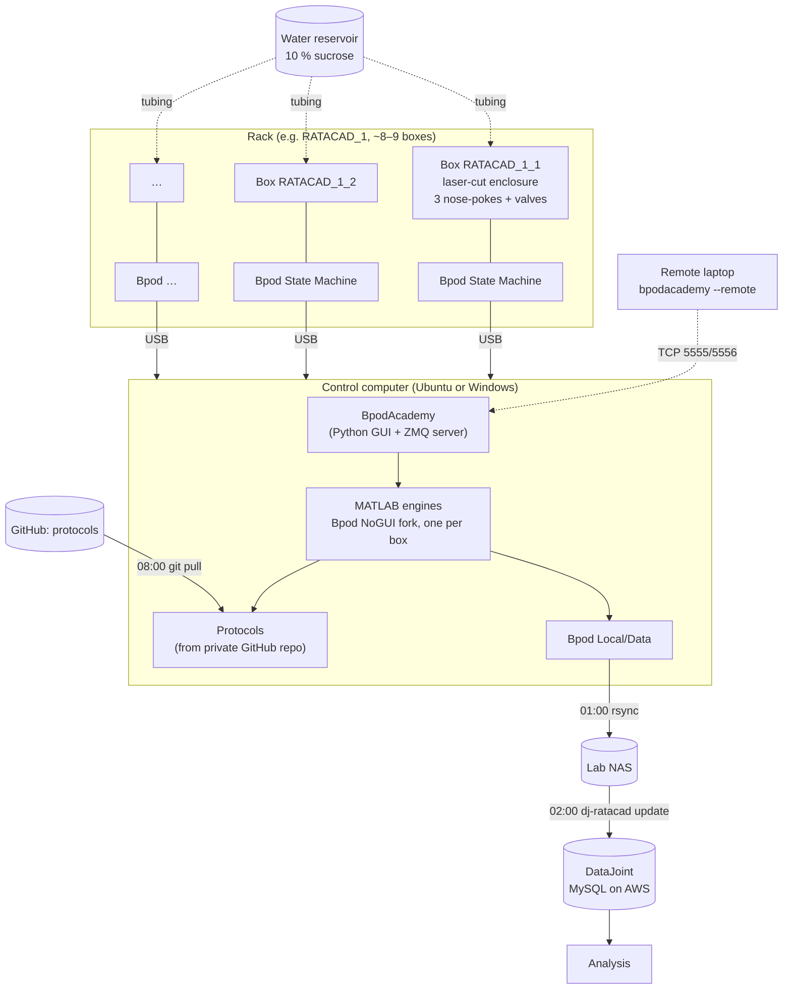

# System architecture

A Rat Academy is a set of **racks of behavior boxes**. Animals live in their
boxes, earn water by doing a task, and move through training stages automatically.
Everything is controlled from a few computers and logged to a central database.

## Components

| Layer | What | Where to read more |
|---|---|---|
| Enclosure | Laser-cut box: port wall with 3 nose-pokes, ventilated lid | [Enclosure](../build/enclosure.md) |
| Hardware | Bpod State Machine, port interface boards, nose-pokes, solenoid valves, water system | [Hardware](../build/hardware.md) |
| Real-time control | Bpod (Sanworks) with the RatAcad **NoGUI** changes, running in MATLAB | [Bpod](../software/bpod.md) |
| Orchestration | **BpodAcademy**: one GUI and server for all boxes, cameras and remote access | [BpodAcademy](../software/bpodacademy.md) |
| Tasks | MATLAB protocols with automated training stages | [Protocols](../software/protocols.md) |
| Storage | rsync to the lab NAS each night | [Scripts](../reference/scripts.md) |
| Database | **dj_ratacad** DataJoint pipeline on MySQL (AWS RDS) | [Data pipeline](../data/pipeline.md) |

## Repositories

| Repo | Purpose | Visibility |
|---|---|---|
| [RatAcad/Bpod_Gen2_Legacy](https://github.com/RatAcad/Bpod_Gen2_Legacy) | Bpod with NoGUI changes (**use this one**) | public, GPL-3.0 |
| [RatAcad/Bpod_Gen2](https://github.com/RatAcad/Bpod_Gen2) | newer Bpod port of NoGUI (not yet BpodAcademy-compatible) | public, GPL-3.0 |
| [RatAcad/BpodAcademy](https://github.com/RatAcad/BpodAcademy) | multi-Bpod GUI and server | public, GPL-3.0 |
| [RatAcad/dj_ratacad](https://github.com/RatAcad/dj_ratacad) | DataJoint pipeline | public |
| RatAcad/ScottLabBpodProtocols | lab MATLAB protocols | **private** |

## Naming conventions

- **Boxes:** `RATACAD_<rack>_<position>`, e.g. `RATACAD_2_4`. The same name is used as
  the BpodAcademy box ID, the Bpod `Name` and the calibration file name, and
  it appears in the database.
- **Subjects and protocols:** no underscores (file names are split on `_`).
- **Data files:** `<Subject>_<Protocol>_<YYYYMMDD>_<HHMMSS>.mat`.
