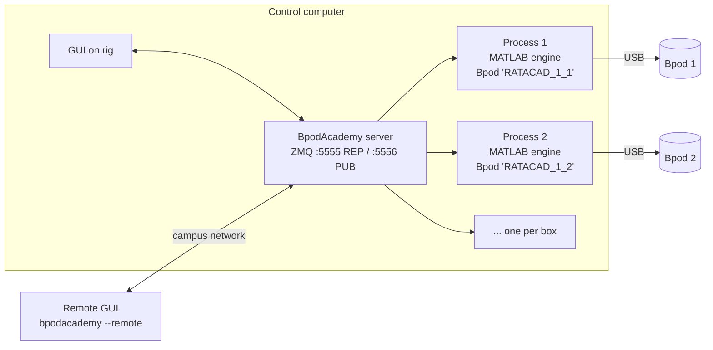

# BpodAcademy

[BpodAcademy](https://github.com/RatAcad/BpodAcademy) is a Python GUI that
controls **many Bpods from one screen**. In it you start each box, calibrate it,
choose the protocol, subject and settings, start and stop sessions, and record video.
You can run it on the rig computer or connect to it remotely.



## How it works

- Each box runs in **its own process with its own MATLAB engine**. The process
  calls the [NoGUI Bpod](bpod.md) functions:

    | Button | MATLAB call |
    |---|---|
    | Start Bpod | `Bpod(serial_port, 0, 0, box_id)` |
    | Show GUI | `BpodSystem.SwitchGUI()` |
    | Calibrate | `BpodLiquidCalibration('Calibrate')` |
    | Run Protocol | `RunProtocol('StartSafe', protocol, subject, settings)` |
    | Stop Protocol | interrupts the run; data is saved |
    | End Bpod | `EndBpod`, then the MATLAB engine exits |

- A **server** listens on **TCP 5555** (commands) and **5556** (broadcasts state
  so every connected GUI stays in sync). Open both ports to campus in the
  [firewall](../setup/computer-ubuntu.md#9-firewall).
- **Boxes are identified by the Bpod's USB serial number**, not by port name. Port
  names can change after a reboot, but the serial number doesn't.

## Install

!!! warning "Python version"
    BpodAcademy imports `distutils`, which was removed in Python 3.12. **Use
    Python ≤ 3.11.** The version must also be one your MATLAB release's engine supports
    ([MathWorks compatibility table](https://www.mathworks.com/support/requirements/python-compatibility.html)).

```bash
conda create -n bpod python=3.10
conda activate bpod
```

**Install the MATLAB Engine for Python** into this environment:

=== "MATLAB R2022b and newer"

    ```bash
    pip install matlabengine==<version matching your MATLAB>
    ```

=== "Older MATLAB (e.g. R2020a)"

    ```bash
    cd <MATLAB_PATH>/extern/engines/python
    sudo ~/anaconda3/envs/bpod/bin/python setup.py install
    ```

    `<MATLAB_PATH>` is usually `/usr/local/MATLAB/<ver>` on Linux,
    `C:/Program Files/MATLAB/<ver>` on Windows, or `/Applications/MATLAB_<ver>.app` on macOS.

**Install BpodAcademy:**

```bash
pip install git+https://github.com/RatAcad/BpodAcademy
```

To update it later, run the [`updateBpodAcademy.sh`](../reference/scripts.md) script.

**Point it at your Bpod data folder** by adding this to `~/.bashrc` (or `~/.bash_profile`):

```bash
export BPOD_DIR="$HOME/ratacad/Bpod Local"
```

`BPOD_DIR` must contain `Protocols/`, `Data/` and `Calibration Files/`. Bpod
creates these the first time you run `Bpod` in MATLAB.

Cameras need `ffmpeg` on the PATH (`sudo apt install ffmpeg` or `conda install ffmpeg`).

## Launch

```bash
conda activate bpod
bpodacademy                 # on the rig: starts the server + GUI
bpodacademy --remote        # from another computer: asks for the rig's IP and port (5555)
bpodacademy-server          # headless server only
```

## First-time configuration

1. **Bpod → Refresh Ports**, then **Bpod → Add** for each box. Give each box an ID
   and pick its USB serial number. We name boxes `RATACAD_<rack>_<position>`, e.g.
   `RATACAD_1_3`. These IDs end up in the database, so choose them once and keep them.
   Use serial `EMU` for an emulator box.
2. **Subjects → Add Subject**, under each protocol, for every animal.
   **Use no underscores in subject or protocol names.** The data pipeline splits
   file names on `_`.
3. **Settings → Create New** or **Copy Existing** to give each subject a
   settings file. Values in the GUI must be scalar numbers.
4. **Start Bpod** on each box, then **Calibrate** it ([Valve calibration](../operate/calibration.md)).
   BpodAcademy warns if `LiquidCalibration_<box>.mat` is missing.
5. **Training → Save** to save which protocol, subject and settings each box runs.
   You can **Load** it again after a restart.

## Files it creates

```text
$BPOD_DIR/
├── Academy/
│   ├── AcademyConfig.csv         # box_id, usb_serial, grid_row, grid_col
│   ├── CameraConfig.csv          # camera settings per box (+ CameraSync device)
│   ├── training/<name>.csv       # saved training configurations
│   └── logs/
│       ├── BpodAcademy.log       # server log
│       └── <box_id>.log          # MATLAB output for each box (look here first when something breaks)
├── Calibration Files/LiquidCalibration_<box_id>.mat
├── Protocols/<Protocol>/<Protocol>.m
└── Data/<Subject>/<Protocol>/
    ├── Session Data/<Subject>_<Protocol>_<YYYYMMDD>_<HHMMSS>.mat
    ├── Session Settings/*.mat
    └── Video Data/{Video,Timestamps}/   # if cameras are enabled
```

## Cameras (optional)

- Any USB/UVC camera that OpenCV can open will work. Per box, set the device, resolution
  (default 640×480), fps (30), exposure, gain and compression, plus the
  **protocol that triggers recording**.
- Video is saved as hourly MP4 files (H.264) with a matching `.npz` file of frame times.
- **Sync (optional):** a **Teensy 3.2** running
  [`camera_sync.ino`](https://github.com/RatAcad/BpodAcademy) timestamps TTL pulses
  from up to 13 Bpods (pins 0–12). Each box's camera is given a `sync_channel`.

## Limits

- **Show GUI** and **Calibrate** work only on the rig computer, not from a remote client.
- You can't show or hide the console, or calibrate, while a protocol is running.
- Protocol settings created in the GUI can only be scalar numbers. For anything more
  complex, set defaults in the protocol's `CheckSettings` function.
